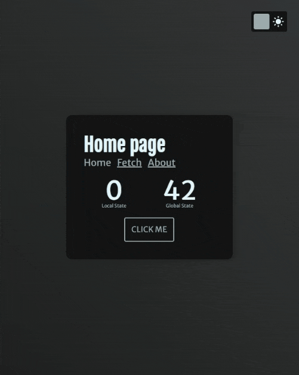

# React Proto - React TypeScript Boilerplate

     

**Template React project with full TypeScrip and SSR support.**

This project is a compilation of different approaches in React development that allows not only to start a new project quickly, but to learn how it works under the hood.

---

## Issue

Every new React developer knows that React is a library, not a complete framework. Thus, it provides maximum flexibility. However, a lot of knowledge is required to create a fully functional web application powered with React.

That is why there exist such a famous framework as [Next.js](https://nextjs.org/) as well as a tool [Create React App (CRA)](https://create-react-app.dev/).

Despite the advantages that such tools have, there are some cons that their user may face:

- Lack of understanding how exactly certain solutions work and why they are applied;
- Lack of flexibility: applied solutions are difficult to fine-tune to your needs;
- The complexity of the codebase of these tools.

As a result, novice React developers have two options for action:

1. Simply apply these tools and frameworks to get the product without going into the nuances of their implementation;
2. Independently collect bit by bit information on how to implement certain functions in React ecosystem.

Thus, the goal of this project is to **collect in one place all the most common methods of working with the React ecosystem** without being tied to a specific framework or tool like CRA.

## What's Inside

Core:

- **React** 18+ (**preact** as an option *coming soon*)
- **webpack** 5+ (with optional **SWC** support and SSR or static build)
- **TypeScript** (with strict rules, including  webpack configuration)

SSR:

- **Express** (with render to stream option including helmet data and initial state pushing)

State:

- **Redux** 4+ (**ModX** as an option *coming soon*)

Router:

- **React Router**

Code Splitting:

- **Loadable Components** (SSR compatible)

API:

- **RTK Query**

Styles:

- **(S)CSS modules** (with TypeScript support)

Linters:

- **ESLint**
- **Stylelint** (including rules order)

Tests:

- *coming soon*

Other:

- API request caching (powerd by RTK Query)
- Hot reload (including state, style and server code hot reloading)
- VSCode support with error higlight and on save fixes
- Script for fast component creation
- Optional Service worker and offline status detector

## The App

This boilerplate includes a simple application with:

- Several screen/pages with their own routes
- Local counter
- Global counter
- One of the components is dynamically loaded
- API requests
- Loading spinner
- Theme swithcer (light and dark)
- Offline detector

## How to Use

### Quick Start (SSR with hot reload)

1. Clone this repo:

   `git clone https://github.com/StopNGo/react-proto`
2. Install all packages:

   `npm i`
3. Run project in a development mode:

   `npm start`
4. Open your browser with the next address:

   `http://localhost:8080/`

### Build and run a server (SSR)

1. Build the project (production bundle will be in the `"dist"` folder):

   `npm run build`
2. Run a server:

   `npm run run`
3. You can test the server locally:

   `http://localhost:3000/`

### Static development mode with hot reload

- Just run the next command and browser will open automatically:

  `npm run start:static`

### Static production

- Run the next command and get a production bundle in the `"dist"` folder:

  `npm run build:static`

## Basic App Configuration

All configuration is available in files with constants:

- `webpack\constants.ts` - contains working directories, SWC option and other related to bundling staff
- `src\constants` - a directory with app configuration constants files
- `src\server\constants.ts` - contains server port and render to stream options

## Documentation

*Coming soon.*

One of the goals of this project is to provide some common soultions in React development and to clarify why they were chosen and how they work. So, such information will be present in this documentation in an orderly fashion.

## Feedback

I welcome any feedbacks, suggestions and questions related to this project.

You can leave them [here](https://github.com/StopNGo/react-proto/issues).

**Thank you!**
